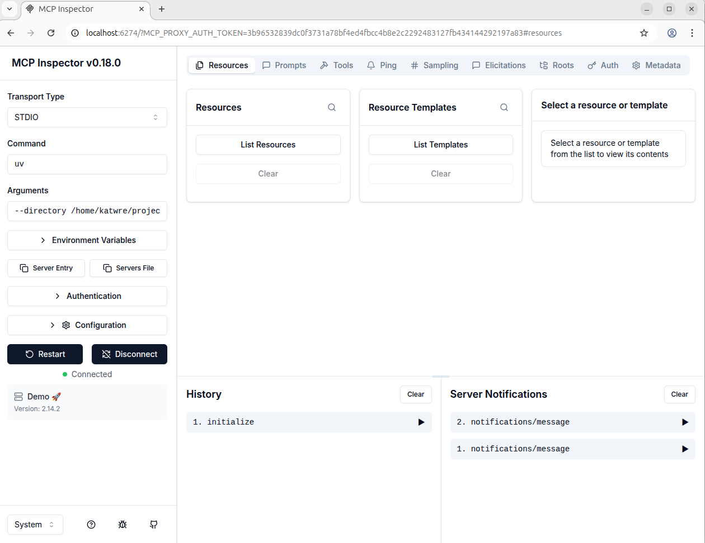
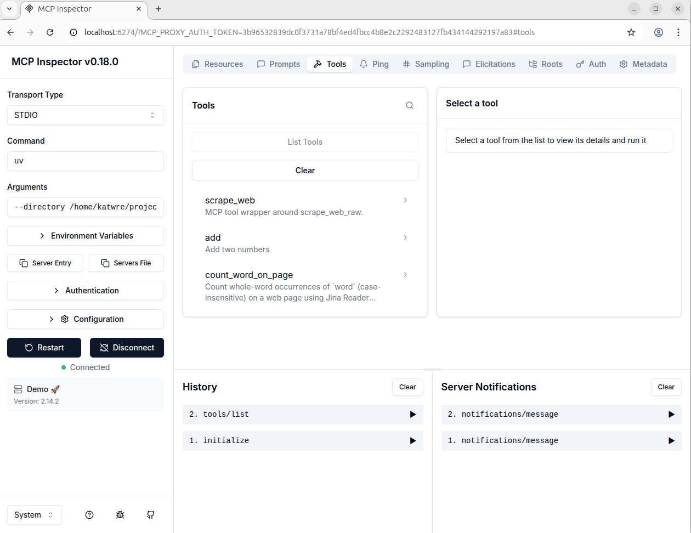
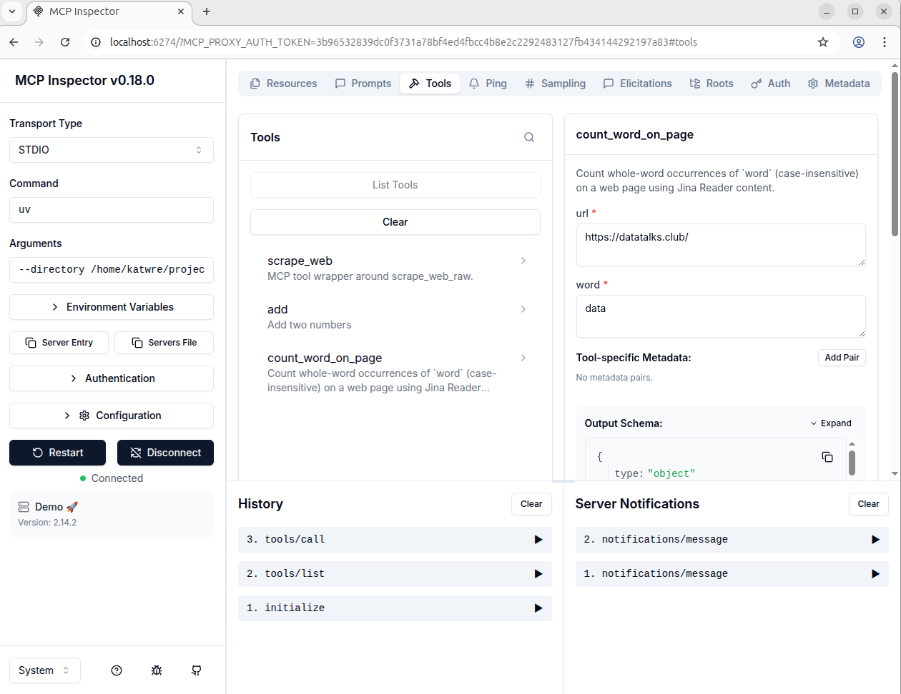
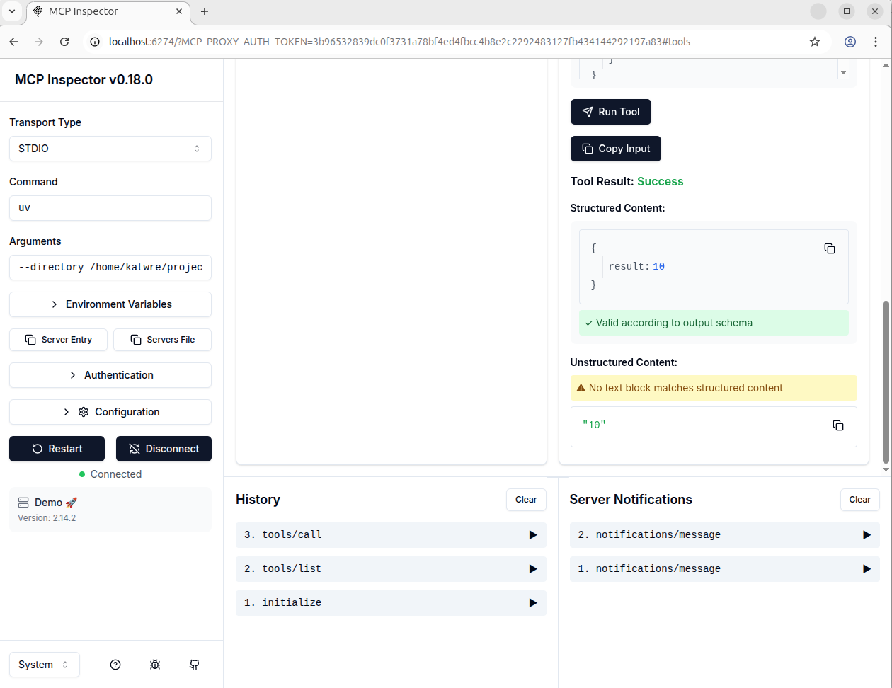

# MCP Server Demo

This is a demonstration of the **MCP (Model Context Protocol)** server with **FastMCP**, **minsearch**, and **Jina Reader** to perform tasks like scraping web content and searching indexed documents. The main goal is to expose an MCP tool (`scrape_web`) and implement a search engine using `minsearch` for query-based document retrieval.

## Table of Contents
1. [Project Setup](#project-setup)
2. [Running the MCP Server](#running-the-mcp-server)
3. [MCP Tools](#mcp-tools)
4. [Search Tool](#search-tool)
5. [Testing the Project](#testing-the-project)
6. [Project Files](#project-files)

## Project Setup

### 1. Initialize the Project
To start, create a directory for the project and initialize it:
```bash
uv init
```

### 2. Install Dependencies
Install the necessary dependencies:
```bash
uv add fastmcp
uv add requests
uv add minsearch
```

Activate the virtual environment:
```bash
source .venv/bin/activate
```

### 3. Transport Mode
The project uses **STDIO** (standard input/output) transport to communicate between the MCP server and the client (e.g., MCP Inspector or any AI assistant).

## Running the MCP Server

To run the server and have it listen for tool calls, use the following command:
```bash
uv --directory /path/to/your/project run python main.py
```
Replace `/path/to/your/project` with the path where you have stored the project.

## MCP Tools

The main tool exposed in this server is **`scrape_web`**, which downloads and returns the content of any webpage. This tool uses **Jina Reader** to scrape the content of the URL passed to it.

Additionally, the server includes a **`count_word_on_page`** tool that counts how many times a specified word appears on a webpage, using the content fetched from `scrape_web`.

### Example Code for `count_word_on_page`:

```python
import re
from main import scrape_web_raw

@mcp.tool
def count_word_on_page(url: str, word: str) -> int:
    # Count whole-word occurrences of `word` (case-insensitive) on `url`
    text = scrape_web_raw(url)
    pattern = rf"{re.escape(word)}"
    return len(re.findall(pattern, text, flags=re.IGNORECASE))
```

## Search Tool

Here, the objective was to create a search engine that downloads a GitHub ZIP file, indexes the `.md` and `.mdx` documents inside it, and allows searching through them. Here's how this is achieved:

1. **Download the ZIP**: If the file is not already present, it will be downloaded from GitHub.
2. **Iterate through all files in the ZIP**: Only `.md` and `.mdx` files are processed.
3. **Normalize filenames**: The filenames are normalized by removing the first segment of the path (i.e., removing `fastmcp-main/`).
4. **Index the files**: We use `minsearch` to index the files, storing the content in the `content` field and the normalized filename in the `filename` field.
5. **Search**: The search engine retrieves the top 5 most relevant documents based on a query.

To run the search, use the command:
```bash
uv run python search.py
```

Example output:
```bash
Loaded 266 .md/.mdx documents

Top 5 results for query='demo':
- examples/testing_demo/README.md
- examples/fastmcp_config_demo/README.md
- examples/atproto_mcp/README.md
- docs/servers/context.mdx
- docs/getting-started/welcome.mdx

FIRST: examples/testing_demo/README.md
```

## Testing the Project

### 1. **Running the MCP Server**
Once the server is up, use **MCP Inspector** to test the tools:

1. Open a terminal window and run the following to start the MCP server:
    ```bash
    uv --directory /path/to/your/project run python main.py
    ```

2. In a separate terminal window, run **MCP Inspector**:
    ```bash
    npx @modelcontextprotocol/inspector       uv --directory /path/to/your/project run python main.py
    ```

3. Open the browser URL printed by Inspector (usually `http://localhost:6274/...`).

### 2. **Using the Tools in MCP Inspector**

1. In **MCP Inspector**, go to **Tools → List**.
2. Verify that the following tools are listed:
    - `scrape_web`
    - `count_word_on_page`
3. Test the `count_word_on_page` tool:
    - Call `count_word_on_page` with the following parameters:
    ```json
    {
      "url": "https://datatalks.club/",
      "word": "data"
    }
    ```

4. Inspect the output returned by Inspector (it should return the number of occurrences of the word "data").

<figure>
<p align="center">
  
  <figcaption><b>Connecting to the MCP Server in MCP Inspector</b><br> This screenshot shows the MCP Inspector connected to the FastMCP server via the STDIO transport. The connection is successful, and the server is ready to process requests.</figcaption>
</p>

<p align="center">
  
  <figcaption><b>Tool List in MCP Inspector</b><br> In this screenshot, the list of available tools in the MCP Inspector is shown. The `scrape_web` and `count_word_on_page` tools are visible and can be selected for execution.</figcaption>
</p>

<p align="center">
  
  <figcaption><b>Running the `count_word_on_page` Tool in MCP Inspector</b><br> This screenshot demonstrates running the `count_word_on_page` tool in MCP Inspector. The user has specified the URL "https://datatalks.club/" and the word "data" for counting occurrences.</figcaption>
</p>

<p align="center">
  
  <figcaption><b>Result of the `count_word_on_page` Tool.</b><br> This screenshot shows the **Resources** section in MCP Inspector and the output of the `count_word_on_page` which is 10!</figcaption>
</p>
</figure>


## Project Files

Here’s a summary of the project files:

### 1. `main.py`
This file contains the main FastMCP server setup, including the tools for scraping the web and counting word occurrences.

### 2. `search.py`
This file implements the search functionality, downloading the GitHub repo ZIP, indexing documents with `minsearch`, and querying them.

### 3. `test.py`
This file tests the web scraping tool by printing out the content of the webpage and the number of characters retrieved.

### 4. `pyproject.toml` and `uv.lock`
These files manage project dependencies and environment configurations.

